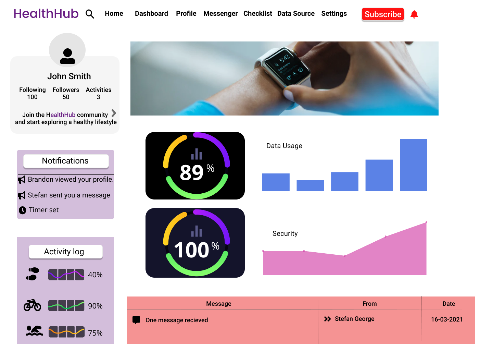

# IS663-HealthHub
HealthHub project system Design source code

## Members

- Akmal Husanov (ah697@njit.edu)
- David Preciado (dp243@njit.edu)
- Roberto Rutherford (rpr4@njit.edu )
- Vedshri Dhoke (vd22@njit.edu)
- Adrianna Brzezinska(ab344@njit.edu)

## Figma prototype

Project prototype can accessed by visiting the below link:

[HealthHub](https://www.figma.com/file/n5EEmndOKlpWAN5ZH7Bmaj/HealthHub?node-id=0%3A1)

## Lincese & copyright

Copyright (c) 2021

Licensed under the [MIT Lincese](LICENSE)
